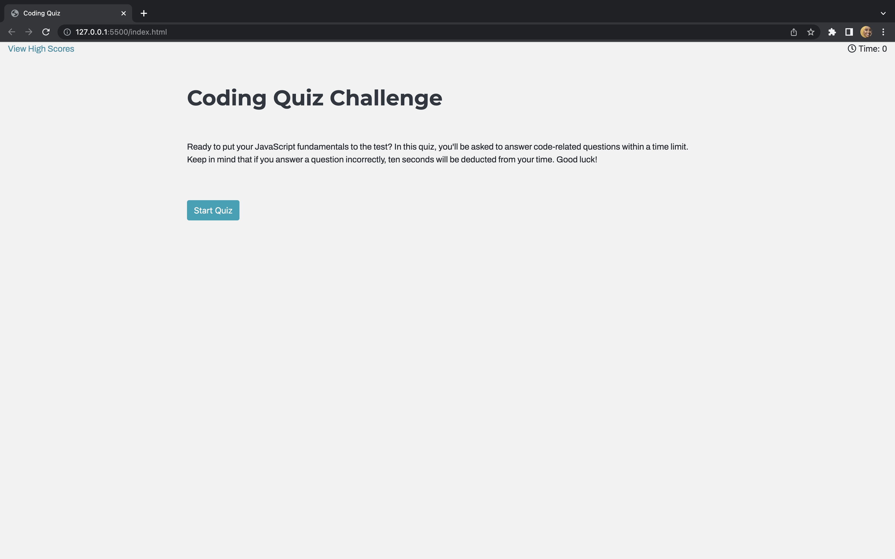
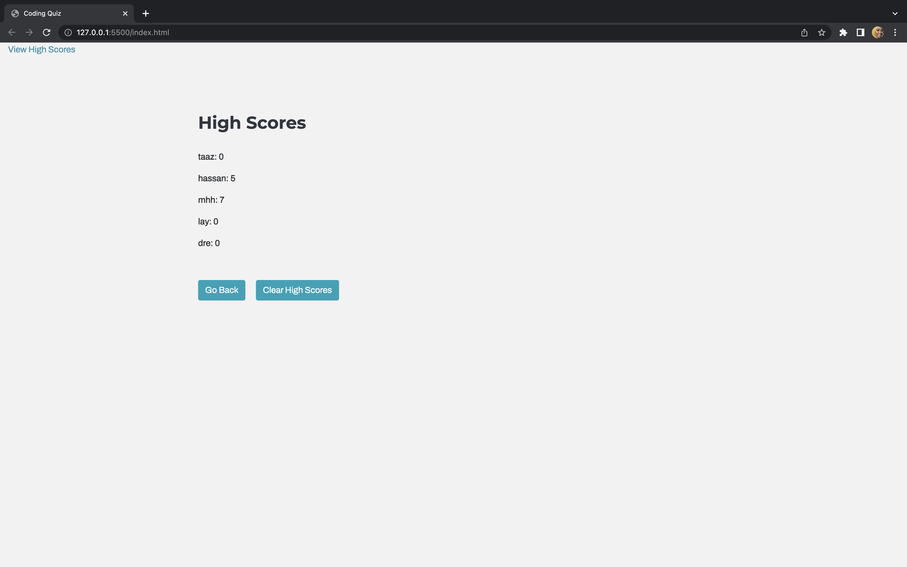

# WEB-API-QUIZ

## Description:
    
    This quiz consists of four stages: the start screen, the quiz itself, the end screen, and the scoreboard. The transitions between these stages are triggered by pressing buttons and implemented using JavaScript. When the quiz begins, a timer of 60 seconds starts running. If a user answers a question correctly, the screen displays "Correct". On the other hand, if the answer is incorrect, the screen displays "Incorrect" and the timer is reduced. Once the quiz is finished, the user can enter their initials, which will be added to their score on the high scores page.

## Motivation:

    This project required us to consider how various components can be integrated to develop a more comprehensive program. By implementing a Bootstrap modal, timer, question array, and local storage for scores, we were faced with a level of complexity that we had not previously encountered. It was necessary to divide the task into smaller pieces and to manage stress while learning new skills. Overall, this project allowed us to improve our problem-solving and time management skills.

## Installation 

    1.	The quiz starts when the user clicks the “Start Quiz” button, and a timer begins counting down.
    2.	The user is then presented with a series of questions.
    3.	When the question is answered, the user is shown the next question.
    4.	If a question is answered incorrectly, time is deducted from the clock.
    5.	The quiz ends when all questions have been answered or when the timer reaches zero.
    6.	Once the quiz is finished, the user has the option to save their initials and scores.

 ]
 ]